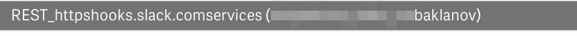
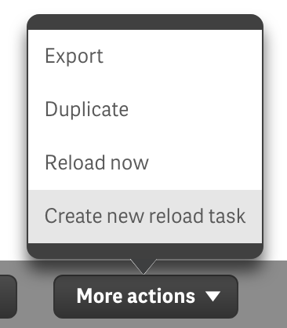

<br>
Welcome to Qlik-Slack Birthday bot
We'll learn how to make bd bot with qlik and slack.

>This bot was built on some researches on Qlik community site(share to link them)<br>
>TL;DR go to qvf folder for full code
<br>


- [1. Birthdays file](#1-birthdays-file)
- [2. Config webhook for slack](#2-config-webhook-for-slack)
- [3. Qlik REST API dummy connector](#3-qlik-rest-api-dummy-connector)
- [4. Qlik application to shoot everyday for  🎉](#4-qlik-application-to-shoot-everyday-for--)

Lets go.🚀

---

## 1. Birthdays file
Lets assume we have some bds.xlsx on some fileshare with such structure of table\\

| F           | I        | MM             | DD            | AD                         |
|:-------------:|:----------:|:----------------:|:---------------:|:----------------------------:|
| *Family name* | *Name*     |*Month of birth* | *Date of birth* | *AD login or Slack username* |
| Clicky    | John | 12             | 14            | somefancylogin             |

---
## 2. Config webhook for slack 

For this part we need to go to [Incoming Webhooks](https://slack.com/apps/A0F7XDUAZ-incoming-webhooks) and install this app to our slack space.
1. Click `Add to slack`
2. Choose channel to where you want it to post our messages


After this you'll get: <br id='URL'>
1. URL like `https://hooks.slack.com/services/•••/•••/•••` (• will be numletters)  
2. Ability to customize logo
3. Ability to name it desired way

Done<br>

----

## 3. Qlik REST API dummy connector

Go to your QlikHub and create empty app(you won't need this one)

- Choose `Add data from files and other sources`<br>


- fill URL from [URL](#URL)
- change type to `POST`
- uncheck `check response type during connecttion`<br>
  
- copy `Name` of our dummy connection from QMC
  
  <br>


----
## 4. Qlik application to shoot everyday for  🎉

Now, we need to create Qlik app with simple logic:
1. open excel
2. take all rows with date and month of birth which = todays date and month
3. form message
4. shoot it to slack
5. wake up again tomorrow
6. ...
7. profit

Let's do this


1. +2. reading excel with some variables for futher work
```json
let bDD = num(Day(Today())); //todays Date
let bMM = num(Month(Today())); // todays Month


// excel loader
[Sheet1]: 
LOAD 
	[F],
	[I],
	[MM],
	[DD],
	[AD],
	[DOMAIN],
    if (num('$(bDD)') = num([DD]) and num('$(bMM)') = num([MM]) , 1, 0) as is_BD //we'll need only valid rows
from [lib://•••.xlsx]
(ooxml, embedded labels, table is [Sheet1]);

Qualify *;
NoConcatenate
tmp: //put target rows somewhere to work with them later
LOAD *
Resident [Sheet1]
Where [is_BD] = 1;

if NoOfRows('tmp') <> 0 then
```
3. Our slack message. For better fomatting options try [block kit builder](https://app.slack.com/block-kit-builder), for example


<br>

```json
let vBody = 
'
{
  "parse":"full",
  "blocks": [


{
      "text": {
        "emoji": true,
        "text": "Happy Birthday, $(FFFF) $(IIII)",
        "type": "plain_text"
      },
      "type": "header"
    },
    {
      "type": "section",
      "text": {
        "type": "mrkdwn",
        "text": "Only up! :chart_with_upwards_trend: \n @$(ADAD)"
        
      }
      
    },
    {
      "type": "divider"
    },
    {
      "elements": [
        {
          "text": "your BI team :qlik: \n #qlik_community / <link>",
          "type": "mrkdwn"
        }
      ],
      "type": "context"
    }


  ]
}
';

```

4. Shoot the message
```sql
// cleanup
LET vBody = Replace(vBody,'"',chr(34) & chr(34));
// Replace the / characters with the chr representations
LET vBody = Replace(vBody,'/',chr(47));
// Replace the \ characters with the chr representations
LET vBody = Replace(vBody,'\',chr(92));
// Replace the * characters with the chr representations
LET vBody = Replace(vBody,'*',chr(42));

LIB CONNECT TO 'full connector name';

RestConnectorMasterTable:
SQL SELECT 
	"col_1"
FROM CSV (header off, delimiter ",", quote "'") "CSV_source"
	WITH CONNECTION (
    	URL "$(vSlackWebHook)",
    	BODY "$(vBody)"
);
Rem
[CSV_source]:
LOAD	'[col_1]'
RESIDENT RestConnectorMasterTable;
```

5. Wakey-wakey 

* Go to /qmc 
* go to apps
* Choose your new app and create new reload task 
  <br>
* tune it to daily execution at desired time


Done.